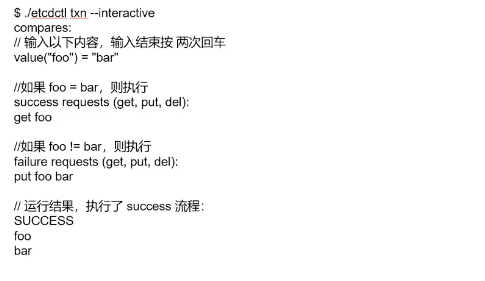
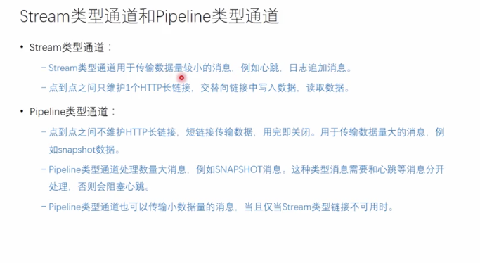

# etcd 简介

etcd是一个高可用的分布式键值(key-value)数据库。etcd内部采用raft协议作为一致性算法，etcd基于Go语言实现。 

- etcd是一个服务发现系统，具备以下的特点： 
- 简单：安装配置简单，而且提供了HTTP API进行交互，使用也很简单 
- 安全：支持SSL证书验证 
- 快速：根据官方提供的benchmark数据，单实例支持每秒2k+读操作 
- 可靠：采用raft算法，实现分布式系统数据的可用性和一致性
- 支持快照和历史事件


# 数据模型

- etcd 支持可靠的键制度存储并且提供了可靠的Watcher机制,其中键值对存储支持**多版本**,并且能够**Watcher历史事件的功能**

  假设我们将K1对应的值V1 修改成了V2,etcd并不会直接将V1修改成V2,而是同时记录V1和V2,==并通过不同个版本号来区分==,<font color=red>另外Watcher的历史事件的含义是,我们可以像一个Key添加Watcher事件,同时可以制定一个历史版本,从该版本开始所有事件都会出发该Watcher</font>

- 不同版本的保留会增加存储空间的占用,etcd会定期进行压缩,清理过旧的数据

- etcd采用了B数索引增加查询速度,在B数的每个索引项中,都存储了一个Key值,这样可以快速的定位到Key或是快速进行范围查找,而每个Key对应了多个版本号,etcd维护了一个全局自增的唯一的版本号(main version) 事务中的每个操作也有唯一版本号,通过这两部分可以确定一个唯一的Value

- <font color=red>在查询的时候,现在内存索引树中痛殴制定的Key,查到改Key对应的所有版本号,然后根据制定的版本号,查到对应的值,如果该版本号被压缩删除,则查找不到</font>

- ==在etcd3中,底层存储是BoltDB,其中的key是版本信息,这样在查询的时候,先查到Key在B树中对应的版本信息,然后在BlotDB中查到改版本的Value==

- 持久化 多版本的并发控制数据模型
- 进行压缩存储区,丢弃最旧的版本,方式数据库暴增(只要有数据的压缩,就会覆盖原来的旧版本数据)
- etcd 适合较小的元数据键值对的处理,对于大的键值对对数据的处理会导致其他请求的事件的增加
- 目前支持的最大的键值对==1M==的RPC(远程过程调用)请求,<font color=red>目前来说没办法支持更大的数据的配置</font>


# 主要功能

1. 简直写入和读取
2. 过期时间
3. 观察者
4. 租约
5. 集群的管理和相关操作
6. 维护操作
7. 用户及权限的管理


# etcd 安装

```
docker run -d -p 2379:2379 -p 2380:2380 --restart=always --net etcdnet --ip 192.167.0.168 --name etcd0 quay.io/coreos/etcd /usr/local/bin/etcd --name autumn-client0 -advertise-client-urls http://192.167.0.168:2379 -listen-client-urls http://0.0.0.0:2379 


-initial-advertise-peer-urls http://192.167.0.168:2380 -listen-peer-urls http://0.0.0.0:2380 -initial-cluster-token etcd-cluster -initial-cluster autumn-client0=http://192.167.0.168:2380,autumn-client1=http://192.167.0.170:2480,autumn-client2=http://192.167.0.172:2580 -initial-cluster-state new


 

```

 ## 单机版

```
docker pull quay.io/coreos/etcd

docker network create --subnet=192.167.0.0/16 etcdnet 


docker run -d -p 2379:2379 -p 2380:2380 --restart=always --net etcdnet --ip 192.167.0.168 --name etcd0 quay.io/coreos/etcd

docker exec -it 065ecbc880bb /bin/sh
```

Brew install etc

#  安装

**brew install etcd**

安装


\#执行etcd即可启动服务

**etcd**

可以看到以下信息：

```
2018-11-26 17:35:02.659194 I | etcdmain: etcd Version: 3.3.10
2018-11-26 17:35:02.659310 I | etcdmain: Git SHA: GitNotFound
2018-11-26 17:35:02.659315 I | etcdmain: Go Version: go1.11.1
2018-11-26 17:35:02.659319 I | etcdmain: Go OS/Arch: darwin/amd64
2018-11-26 17:35:02.659324 I | etcdmain: setting maximum number of CPUs to 4, total number of available CPUs is 4
2018-11-26 17:35:02.659335 N | etcdmain: failed to detect default host (default host not supported on darwin_amd64)
2018-11-26 17:35:02.659345 W | etcdmain: no data-dir provided, using default data-dir ./default.etcd
2018-11-26 17:35:02.659758 N | etcdmain: the server is already initialized as member before, starting as etcd member...
2018-11-26 17:35:02.661503 I | embed: listening for peers on http://localhost:2380
2018-11-26 17:35:02.661918 I | embed: listening for client requests on localhost:2379
2018-11-26 17:35:02.666171 I | etcdserver: name = default
2018-11-26 17:35:02.666189 I | etcdserver: data dir = default.etcd
2018-11-26 17:35:02.666195 I | etcdserver: member dir = default.etcd/member
2018-11-26 17:35:02.666199 I | etcdserver: heartbeat = 100ms
2018-11-26 17:35:02.666203 I | etcdserver: election = 1000ms
2018-11-26 17:35:02.666207 I | etcdserver: snapshot count = 100000
2018-11-26 17:35:02.666220 I | etcdserver: advertise client URLs = http://localhost:2379
2018-11-26 17:35:02.668339 I | etcdserver: restarting member 8e9e05c52164694d in cluster cdf818194e3a8c32 at commit index 4
2018-11-26 17:35:02.668614 I | raft: 8e9e05c52164694d became follower at term 2
2018-11-26 17:35:02.668636 I | raft: newRaft 8e9e05c52164694d [peers: [], term: 2, commit: 4, applied: 0, lastindex: 4, lastterm: 2]
2018-11-26 17:35:02.671551 W | auth: simple token is not cryptographically signed
2018-11-26 17:35:02.672511 I | etcdserver: starting server... [version: 3.3.10, cluster version: to_be_decided]
2018-11-26 17:35:02.672700 E | etcdserver: cannot monitor file descriptor usage (cannot get FDUsage on darwin)
2018-11-26 17:35:02.673933 I | etcdserver/membership: added member 8e9e05c52164694d [http://localhost:2380] to cluster cdf818194e3a8c32
2018-11-26 17:35:02.674131 N | etcdserver/membership: set the initial cluster version to 3.3
2018-11-26 17:35:02.674257 I | etcdserver/api: enabled capabilities for version 3.3
2018-11-26 17:35:03.671575 I | raft: 8e9e05c52164694d is starting a new election at term 2
2018-11-26 17:35:03.671609 I | raft: 8e9e05c52164694d became candidate at term 3
2018-11-26 17:35:03.671916 I | raft: 8e9e05c52164694d received MsgVoteResp from 8e9e05c52164694d at term 3
2018-11-26 17:35:03.671942 I | raft: 8e9e05c52164694d became leader at term 3
2018-11-26 17:35:03.671951 I | raft: raft.node: 8e9e05c52164694d elected leader 8e9e05c52164694d at term 3
2018-11-26 17:35:03.672275 I | etcdserver: published {Name:default ClientURLs:[http://localhost:2379]} to cluster cdf818194e3a8c32
2018-11-26 17:35:03.672537 I | embed: ready to serve client requests
2018-11-26 17:35:03.682936 N | embed: serving insecure client requests on 127.0.0.1:2379, this is strongly discouraged!


```


**etcdserver: name = default name表示节点名称，默认为default
data-dir保存日志和快照的目录，默认为当前工作目录default.etcd/
在http://localhost:2380和集群中其他节点通信
在http://localhost:2379提供HTTP API服务，供客户端交互。等会配置webui就是这个地址
etcdserver: heartbeat = 100ms leader发送心跳到followers的间隔时间
etcdserver: election = 1000ms 重新投票的超时时间，如果follow在该时间间隔没有收到心跳包，会触发重新投票，默认为1000ms**

 


三、安装etcd webui
记得启动Etcd服务。
先安装node，git环境，然后clone

**git clone https://github.com/henszey/etcd-browser.git
cd etcd-browser/
vim server.js**  

编辑server.js，修改内容如下：

**var etcdHost = process.env.ETCD_HOST || '127.0.0.1';  # etcd 主机IP
var etcdPort = process.env.ETCD_PORT || 4001;      # etcd 主机端口
var serverPort = process.env.SERVER_PORT || 8000;    # etcd-browser 监听端口**

然后启动

**node server.js**

访问：http://127.0.0.1:8000/


# 设置v3

export ETCDCTL_API=3


# ==etcd 集群安装==

1. 下载镜像

```
$ docker pull quay.io/coreos/etcd
```

2. 编辑etcd-compose.yml

```
version: '3'
services:
  etcd-node1:
    image: "quay.io/coreos/etcd"
    container_name: "etcd-node1"
    ports:
      - "12379:2379"
      - "12380:2380"
    command: 'etcd -name etcd-node1 -advertise-client-urls http://0.0.0.0:2379 -listen-client-urls http://0.0.0.0:2379 -listen-peer-urls http://0.0.0.0:2380 -initial-cluster-token etcd-cluster -initial-cluster "etcd-node1=http://etcd-node1:2380,etcd-node2=http://etcd-node2:2380,etcd-node3=http://etcd-node3:2380" -initial-cluster-state new'
    networks:
      - "etcd"

  etcd-node2:
    image: "quay.io/coreos/etcd"
    container_name: "etcd-node2"
    ports:
      - "22379:2379"
      - "22380:2380"
    command: 'etcd -name etcd-node2 -advertise-client-urls http://0.0.0.0:2379 -listen-client-urls http://0.0.0.0:2379 -listen-peer-urls http://0.0.0.0:2380 -initial-cluster-token etcd-cluster -initial-cluster "etcd-node1=http://etcd-node1:2380,etcd-node2=http://etcd-node2:2380,etcd-node3=http://etcd-node3:2380" -initial-cluster-state new'
    networks:
      - "etcd"

  etcd-node3:
    image: "quay.io/coreos/etcd"
    container_name: "etcd-node3"
    ports:
      - "32379:2379"
      - "32380:2380"
    command: 'etcd -name etcd-node3 -advertise-client-urls http://0.0.0.0:2379 -listen-client-urls http://0.0.0.0:2379 -listen-peer-urls http://0.0.0.0:2380 -initial-cluster-token etcd-cluster -initial-cluster "etcd-node1=http://etcd-node1:2380,etcd-node2=http://etcd-node2:2380,etcd-node3=http://etcd-node3:2380" -initial-cluster-state new'
    networks:
      - "etcd"

networks:
  etcd:
```

- **data-dir:**指定节点的数据存储目录，这些数据包括节点ID，集群ID，集群初始化配置，Snapshot文件，若未指定—wal-dir，还会存储WAL文件；
- **wal-dir:**指定节点的was文件的存储目录，若指定了该参数，wal文件会和其他数据文件分开存储。
- **name:** 节点名称
- **initial-advertise-peer-urls:** 告知集群其他节点url.(`对于集群内提供服务的url`)
- **listen-peer-urls:** 监听URL，用于与其他节点通讯
- **advertise-client-urls:** 告知客户端url, 也就是服务的url(`对外提供服务的utl`)
- **initial-cluster-token:** 集群的ID
- **initial-cluster:** 集群中所有节点


3. 启动docker-compose

```
$ docker-compose -f etcd-compose.yml up -d
```

4. 检查容器状态查询节点成员

```
$ docker-compose -f etcd-compose.yml ps                                                                                                                                        
   Name                 Command               State                        Ports
------------------------------------------------------------------------------------------------------
etcd-node1   etcd -name etcd-node1 -adv ...   Up      0.0.0.0:12379->2379/tcp, 0.0.0.0:12380->2380/tcp
etcd-node2   etcd -name etcd-node2 -adv ...   Up      0.0.0.0:22379->2379/tcp, 0.0.0.0:22380->2380/tcp
etcd-node3   etcd -name etcd-node3 -adv ...   Up      0.0.0.0:32379->2379/tcp, 0.0.0.0:32380->2380/tcp
```

```
# 查询每台的成员，结果是一致的
# curl http://127.0.0.1:12379/v2/members | json_pp
# curl http://127.0.0.1:22379/v2/members | json_pp
# curl http://127.0.0.1:32379/v2/members | json_pp
{
   "members" : [
      {
         "id" : "5b926f852fa1811",
         "peerURLs" : [
            "http://etcd-node1:2380"
         ],
         "clientURLs" : [
            "http://0.0.0.0:2379"
         ],
         "name" : "etcd-node1"
      },
      {
         "peerURLs" : [
            "http://etcd-node2:2380"
         ],
         "clientURLs" : [
            "http://0.0.0.0:2379"
         ],
         "name" : "etcd-node2",
         "id" : "9b3cd975d37c44ce"
      },
      {
         "id" : "9e13ad3ed0f8a26b",
         "peerURLs" : [
            "http://etcd-node3:2380"
         ],
         "clientURLs" : [
            "http://0.0.0.0:2379"
         ],
         "name" : "etcd-node3"
      }
   ]
}
```

5. 销毁测试环境

```
$ docker-compose -f etcd-compose.yml down
Stopping etcd-node2 ... done
Stopping etcd-node1 ... done
Stopping etcd-node3 ... done
Removing etcd-node2 ... done
Removing etcd-node1 ... done
Removing etcd-node3 ... done
Removing network docker-compose_etcd
```

```
cd $GOPATH/github.com/shiguanghuxian/etcd-manage/static

docker-compose up

作者：时光弧线
链接：https://segmentfault.com/a/1190000016840950
来源：SegmentFault 思否
著作权归作者所有。商业转载请联系作者获得授权，非商业转载请注明出处。


作者：时光弧线
链接：https://segmentfault.com/a/1190000016840950
来源：SegmentFault 思否
著作权归作者所有。商业转载请联系作者获得授权，非商业转载请注明出处。


version: "3.5"
 services:
   e3w:
     hostname: e3w
     image: soyking/e3w:latest
     ports:
       - "8000:8080"
     volumes:
       - "/var/docker/e3w/conf/config.ini:/app/conf/config.default.ini"
     networks:
       - e3wnet
       - "etcd"

 networks:
   e3wnet:
     name: e3wnet
  "etcd":
     external: true
     name: "etcd"

```

## etcd-browser

```
docker run --rm  -d --name etcd-browser \
-p 8000:8000 \
--env ETCD_HOST=10.211.55.25 \
--env ETCD_PORT=2379 \
buddho/etcd-browser
```

运行后访问http://10.211.55.25:8000/
看到如下界面，可以看到上面添加的所有数据，这里我使用界面添加了漫威和DC的英雄


## etcdkeeper


```
docker run -it -d --name etcdkeeper \
-p 8080:8080 \
deltaprojects/etcdkeeper
```

访问http://10.211.55.25:8080/etcdkeeper/，输入etcd的地址,看到如下界面


到这里，etcd的单机版搭建、集群版、客户端使用、rest api、web管理界面等功能都介绍了，你还在等什么，赶紧high起来

## e3w

https://github.com/xiaowei520/e3w

## etcd-manager

https://segmentfault.com/a/1190000016840950


## docker 安装错误处理

```
Error response from daemon: Get https://registry-1.docker.io/v2/deltaprojects/etcdkeeper/manifests/latest: net/http: TLS handshake timeout
```

该错误是连接不到网络，需要在本地配置hosts地址

通过该命令：dig @114.114.114.114 [registry-1.docker.io](http://registry-1.docker.io/) 可以获取到连接地址。

# etcd 基本命令使用

获取所有key

 Curl http://127.0.0.1:22379/v2/keys\?recursive=true


查看指定key-value
  curl -s http://127.0.0.1:2479/v2/keys/services/default/tenantmanager


## 启动

etcd 就可以

## 查看集群成员

etcdctl member list


## 查看集群状态--leader节点

V3 etcdctl --write-out=table endpoint status

V2 etcdctl cluster-health


==查看leader状态==

```
curl http://127.0.0.1:2379/v2/stats/leader   查看leader V2
curl http://127.0.0.1:2379/v2/stats/self   查看自己 V2
```


==--endpoint==

如果机器和集群不再一个node 可以控制别的node

etcdctl --endpoint=127.0.0.1:2379 version


## 写

```
etcdctl set /key value  V2
etcdctl put /key value V3
即使是一个集群 V2 写入的在V3读取不到

V2 支持过期时间
etcdctl set /key value --ttl 10
V3 是租约来实现过期时间
```


## 读

etcdctl get key

获取一xxx开头的

etcdctl get key --prefix


V2

Curl http://127.0.0.1:2379/v2/keys


## 删除key

V2 etcdctl rm key

curl -XDELETE http://127.0.0.1:2379/v2/keys/key名字


V3 etcdctl del key


# 租约

管理一批key的定时器


```
-> % etcdctl lease grant 60
lease 694d730ac75a2c0b granted with TTL(60s)
zhangqiuli@zhangqiulideMacBook-Pro [22时56分47秒] [~]
-> % etcdctl put test_leads 300 --lease=694d730ac75a2c0b
OK
zhangqiuli@zhangqiulideMacBook-Pro [22时57分23秒] [~]
-> % etcdctl lease keep-alive 694d730ac75a2c0b
lease 694d730ac75a2c0b keepalived with TTL(60)

^C
zhangqiuli@zhangqiulideMacBook-Pro [22时58分01秒] [~]
-> % etcdctl lease revoke 694d730ac75a2c0b
lease 694d730ac75a2c0b revoked
zhangqiuli@zhangqiulideMacBook-Pro [22时58分22秒] [~]
-> % etcdctl get test_leads
```

续租是一直在给续租的


# 观察者

监控事件的变化


# 原子操作


# 事务




# 分布式锁


# 选举




# ==------------------------------------------------==


# etcd 应用场景

## 服务发现**Service Discovery**

服务发现要解决的也是分布式系统中最常见的问题之一，即在同一个分布式集群中的进程或服务，要如何才能找到对方并建立连接。本质上来说，服务发现就是想要了解集群中是否有进程在监听udp或tcp端口，并且通过名字就可以查找和连接。要解决服务发现的问题，需要有下面三大支柱，缺一不可。

 

<font color=red>一个强一致性、高可用的服务存储目录。</font>基于Raft算法的etcd天生就是这样一个强一致性高可用的服务存储目录。

<font color=red>一种注册服务和监控服务健康状态的机制。用户可以在etcd中注册服务，并且对注册的服务设置key TTL，定时保持服务的心跳以达到监控健康状态的效果。</font>

一种查找和连接服务的机制。通过在etcd指定的主题下注册的服务也能在对应的主题下查找到。为了确保连接，我们可以在每个服务机器上都部署一个Proxy模式的etcd，这样就可以确保能访问etcd集群的服务都能互相连接。

 

来看服务发现对应的具体场景：

- <font color=red>微服务协同工作架构中，服务动态添加。随着Docker容器的流行，多种微服务共同协作，构成一个相对功能强大的架构的案例越来越多。透明化的动态添加这些服务的需求也日益强烈。通过服务发现机制，在etcd中注册某个服务名字的目录，在该目录下存储可用的服务节点的IP。在使用服务的过程中，只要从服务目录下查找可用的服务节点去使用即可。</font>


- <font color=red>PaaS平台中应用多实例与实例故障重启透明化。PaaS平台中的应用一般都有多个实例，通过域名，不仅可以透明的对这多个实例进行访问，而且还可以做到负载均衡。但是应用的某个实例随时都有可能故障重启，这时就需要动态的配置域名解析（路由）中的信息。通过etcd的服务发现功能就可以轻松解决这个动态配置的问题。</font>


## 消息订阅与发布

在分布式系统中，最适用的一种组件间通信方式就是消息发布与订阅。即构建一个**配置共享中心**，==数据提供者在这个配置中心发布消息，而消息使用者则订阅他们关心的主题，一旦主题有消息发布，就会实时通知订阅者。通过这种方式可以做到分布式系统配置的集中式管理与动态更新。==

- 应用中用到的一些配置信息放到etcd上进行集中管理。这类场景的使用方式通常是这样：<font color=red>应用在启动的时候主动从etcd获取一次配置信息，同时，在etcd节点上注册一个Watcher并等待，以后每次配置有更新的时候，etcd都会实时通知订阅者，以此达到获取最新配置信息的目的。</font>
- 分布式搜索服务中，索引的元信息和服务器集群机器的节点状态存放在etcd中，供各个客户端订阅使用。使用etcd的key TTL功能可以确保机器状态是实时更新的。
- ==分布式日志收集系统==。这个系统的核心工作是收集分布在不同机器的日志。收集器通常是按照应用（或主题）来分配收集任务单元，因此可以在etcd上创建一个以应用（主题）命名的目录P，并将这个应用（主题相关）的所有机器ip，以子目录的形式存储到目录P上，然后设置一个etcd递归的Watcher，递归式的监控应用（主题）目录下所有信息的变动。这样就实现了机器IP（消息）变动的时候，能够实时通知到收集器调整任务分配。
- 系统中信息需要动态自动获取与人工干预修改信息请求内容的情况。通常是暴露出接口，例如JMX接口，来获取一些运行时的信息。引入etcd之后，就不用自己实现一套方案了，只要将这些信息存放到指定的etcd目录中即可，etcd的这些目录就可以通过HTTP的接口在外部访问。


## 负载均衡

在场景一中也提到了负载均衡，**本文所指的负载均衡均为软负载均衡**。分布式系统中，为了保证服务的高可用以及数据的一致性，通常都会把数据和服务部署多份，以此达到对等服务，即使其中的某一个服务失效了，也不影响使用。由此带来的坏处是数据写入性能下降，而好处则是数据访问时的负载均衡。因为每个对等服务节点上都存有完整的数据，所以用户的访问流量就可以分流到不同的机器上。

- <font color=red>etcd本身分布式架构存储的信息访问支持负载均衡。</font>etcd集群化以后，每个etcd的核心节点都可以处理用户的请求。所以，把数据量小但是访问频繁的消息数据直接存储到etcd中也是个不错的选择，如业务系统中常用的二级代码表（在表中存储代码，在etcd中存储代码所代表的具体含义，业务系统调用查表的过程，就需要查找表中代码的含义）。
- <font color=green>利用etcd维护一个负载均衡节点表。etcd可以监控一个集群中多个节点的状态，当有一个请求发过来后，可以轮询式的把请求转发给存活着的多个状态。</font>类似KafkaMQ，通过ZooKeeper来维护生产者和消费者的负载均衡。同样也可以用etcd来做ZooKeeper的工作。


## 分布式通知和协调

这里说到的分布式通知与协调，与消息发布和订阅有些相似。都用到了etcd中的Watcher机制，通过注册与异步通知机制，实现分布式环境下不同系统之间的通知与协调，从而对数据变更做到实时处理。实现方式通常是这样：不同系统都在etcd上对同一个目录进行注册，同时设置Watcher观测该目录的变化（如果对子目录的变化也有需要，可以设置递归模式），当某个系统更新了etcd的目录，那么设置了Watcher的系统就会收到通知，并作出相应处理。

- 通过etcd进行低耦合的心跳检测。检测系统和被检测系统通过etcd上某个目录关联而非直接关联起来，这样可以大大减少系统的耦合性。
- 通过etcd完成系统调度。某系统有控制台和推送系统两部分组成，控制台的职责是控制推送系统进行相应的推送工作。管理人员在控制台作的一些操作，实际上是修改了etcd上某些目录节点的状态，而etcd就把这些变化通知给注册了Watcher的推送系统客户端，推送系统再作出相应的推送任务。
- 通过etcd完成工作汇报。大部分类似的任务分发系统，子任务启动后，到etcd来注册一个临时工作目录，并且定时将自己的进度进行汇报（将进度写入到这个临时目录），这样任务管理者就能够实时知道任务进度。


## 分布式锁

因为etcd使用Raft算法保持了数据的强一致性，某次操作存储到集群中的值必然是全局一致的，所以很容易实现分布式锁。锁服务有两种使用方式，一是保持独占，二是控制时序。

- 保持独占即所有获取锁的用户最终只有一个可以得到。etcd为此提供了一套实现分布式锁原子操作CAS（CompareAndSwap）的API。通过设置prevExist值，可以保证在多个节点同时去创建某个目录时，只有一个成功。而创建成功的用户就可以认为是获得了锁。
- 控制时序，即所有想要获得锁的用户都会被安排执行，但是获得锁的顺序也是全局唯一的，同时决定了执行顺序。etcd为此也提供了一套API（自动创建有序键），对一个目录建值时指定为POST动作，这样etcd会自动在目录下生成一个当前最大的值为键，存储这个新的值（客户端编号）。同时还可以使用API按顺序列出所有当前目录下的键值。此时这些键的值就是客户端的时序，而这些键中存储的值可以是代表客户端的编号。


## 分布式队列

分布式队列的常规用法与场景五中所描述的分布式锁的控制时序用法类似，即创建一个先进先出的队列，保证顺序。

另一种比较有意思的实现是在保证队列达到某个条件时再统一按顺序执行。这种方法的实现可以在/queue这个目录中另外建立一个/queue/condition节点。

- condition可以表示队列大小。比如一个大的任务需要很多小任务就绪的情况下才能执行，每次有一个小任务就绪，就给这个condition数字加1，直到达到大任务规定的数字，再开始执行队列里的一系列小任务，最终执行大任务。
- condition可以表示某个任务在不在队列。这个任务可以是所有排序任务的首个执行程序，也可以是拓扑结构中没有依赖的点。通常，必须执行这些任务后才能执行队列中的其他任务。
- condition还可以表示其它的一类开始执行任务的通知。可以由控制程序指定，当condition出现变化时，开始执行队列任务。
- 

## 集群监控与Leader竞选

通过etcd来进行监控实现起来非常简单并且实时性强。

1. 前面几个场景已经提到Watcher机制，当某个节点消失或有变动时，Watcher会第一时间发现并告知用户。
2. 节点可以设置TTL key，比如每隔30s发送一次心跳使代表该机器存活的节点继续存在，否则节点消失。

这样就可以第一时间检测到各节点的健康状态，以完成集群的监控要求。

另外，使用分布式锁，可以完成Leader竞选。这种场景通常是一些长时间CPU计算或者使用IO操作的机器，只需要竞选出的Leader计算或处理一次，就可以把结果复制给其他的Follower。从而避免重复劳动，节省计算资源。

这个的经典场景是搜索系统中建立全量索引。如果每个机器都进行一遍索引的建立，不但耗时而且建立索引的一致性不能保证。通过在etcd的CAS机制同时创建一个节点，创建成功的机器作为Leader，进行索引计算，然后把计算结果分发到其它节点。


## 分布式事务


