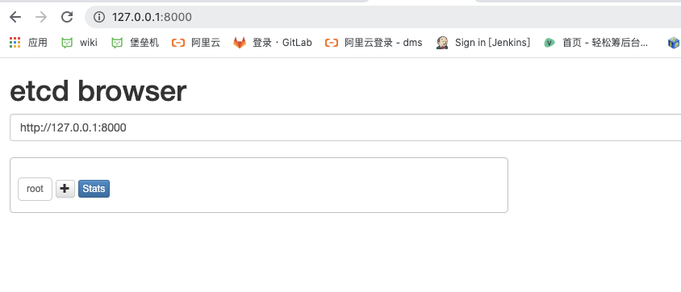

# etcd 安装

```
docker run -d -p 2379:2379 -p 2380:2380 --restart=always --net etcdnet --ip 192.167.0.168 --name etcd0 quay.io/coreos/etcd /usr/local/bin/etcd --name autumn-client0 -advertise-client-urls http://192.167.0.168:2379 -listen-client-urls http://0.0.0.0:2379 


-initial-advertise-peer-urls http://192.167.0.168:2380 -listen-peer-urls http://0.0.0.0:2380 -initial-cluster-token etcd-cluster -initial-cluster autumn-client0=http://192.167.0.168:2380,autumn-client1=http://192.167.0.170:2480,autumn-client2=http://192.167.0.172:2580 -initial-cluster-state new


 

```

 ## 单机版

```
docker pull quay.io/coreos/etcd

docker network create --subnet=192.167.0.0/16 etcdnet 


docker run -d -p 2379:2379 -p 2380:2380 --restart=always --net etcdnet --ip 192.167.0.168 --name etcd0 quay.io/coreos/etcd

docker exec -it 065ecbc880bb /bin/sh
```

Brew install etc

#  安装

**brew install etcd**

安装


\#执行etcd即可启动服务

**etcd**

可以看到以下信息：

2018-11-26 17:35:02.659194 I | etcdmain: etcd Version: 3.3.10
2018-11-26 17:35:02.659310 I | etcdmain: Git SHA: GitNotFound
2018-11-26 17:35:02.659315 I | etcdmain: Go Version: go1.11.1
2018-11-26 17:35:02.659319 I | etcdmain: Go OS/Arch: darwin/amd64
2018-11-26 17:35:02.659324 I | etcdmain: setting maximum number of CPUs to 4, total number of available CPUs is 4
2018-11-26 17:35:02.659335 N | etcdmain: failed to detect default host (default host not supported on darwin_amd64)
2018-11-26 17:35:02.659345 W | etcdmain: no data-dir provided, using default data-dir ./default.etcd
2018-11-26 17:35:02.659758 N | etcdmain: the server is already initialized as member before, starting as etcd member...
2018-11-26 17:35:02.661503 I | embed: listening for peers on http://localhost:2380
2018-11-26 17:35:02.661918 I | embed: listening for client requests on localhost:2379
2018-11-26 17:35:02.666171 I | etcdserver: name = default
2018-11-26 17:35:02.666189 I | etcdserver: data dir = default.etcd
2018-11-26 17:35:02.666195 I | etcdserver: member dir = default.etcd/member
2018-11-26 17:35:02.666199 I | etcdserver: heartbeat = 100ms
2018-11-26 17:35:02.666203 I | etcdserver: election = 1000ms
2018-11-26 17:35:02.666207 I | etcdserver: snapshot count = 100000
2018-11-26 17:35:02.666220 I | etcdserver: advertise client URLs = http://localhost:2379
2018-11-26 17:35:02.668339 I | etcdserver: restarting member 8e9e05c52164694d in cluster cdf818194e3a8c32 at commit index 4
2018-11-26 17:35:02.668614 I | raft: 8e9e05c52164694d became follower at term 2
2018-11-26 17:35:02.668636 I | raft: newRaft 8e9e05c52164694d [peers: [], term: 2, commit: 4, applied: 0, lastindex: 4, lastterm: 2]
2018-11-26 17:35:02.671551 W | auth: simple token is not cryptographically signed
2018-11-26 17:35:02.672511 I | etcdserver: starting server... [version: 3.3.10, cluster version: to_be_decided]
2018-11-26 17:35:02.672700 E | etcdserver: cannot monitor file descriptor usage (cannot get FDUsage on darwin)
2018-11-26 17:35:02.673933 I | etcdserver/membership: added member 8e9e05c52164694d [http://localhost:2380] to cluster cdf818194e3a8c32
2018-11-26 17:35:02.674131 N | etcdserver/membership: set the initial cluster version to 3.3
2018-11-26 17:35:02.674257 I | etcdserver/api: enabled capabilities for version 3.3
2018-11-26 17:35:03.671575 I | raft: 8e9e05c52164694d is starting a new election at term 2
2018-11-26 17:35:03.671609 I | raft: 8e9e05c52164694d became candidate at term 3
2018-11-26 17:35:03.671916 I | raft: 8e9e05c52164694d received MsgVoteResp from 8e9e05c52164694d at term 3
2018-11-26 17:35:03.671942 I | raft: 8e9e05c52164694d became leader at term 3
2018-11-26 17:35:03.671951 I | raft: raft.node: 8e9e05c52164694d elected leader 8e9e05c52164694d at term 3
2018-11-26 17:35:03.672275 I | etcdserver: published {Name:default ClientURLs:[http://localhost:2379]} to cluster cdf818194e3a8c32
2018-11-26 17:35:03.672537 I | embed: ready to serve client requests
2018-11-26 17:35:03.682936 N | embed: serving insecure client requests on 127.0.0.1:2379, this is strongly discouraged!
 


**etcdserver: name = default name表示节点名称，默认为default
data-dir保存日志和快照的目录，默认为当前工作目录default.etcd/
在http://localhost:2380和集群中其他节点通信
在http://localhost:2379提供HTTP API服务，供客户端交互。等会配置webui就是这个地址
etcdserver: heartbeat = 100ms leader发送心跳到followers的间隔时间
etcdserver: election = 1000ms 重新投票的超时时间，如果follow在该时间间隔没有收到心跳包，会触发重新投票，默认为1000ms**

 


三、安装etcd webui
记得启动Etcd服务。
先安装node，git环境，然后clone

**git clone https://github.com/henszey/etcd-browser.git
cd etcd-browser/
vim server.js**  

编辑server.js，修改内容如下：

**var etcdHost = process.env.ETCD_HOST || '127.0.0.1';  # etcd 主机IP
var etcdPort = process.env.ETCD_PORT || 4001;      # etcd 主机端口
var serverPort = process.env.SERVER_PORT || 8000;    # etcd-browser 监听端口**

然后启动

**node server.js**

访问：http://127.0.0.1:8000/




# 设置v3

export ETCDCTL_API=3