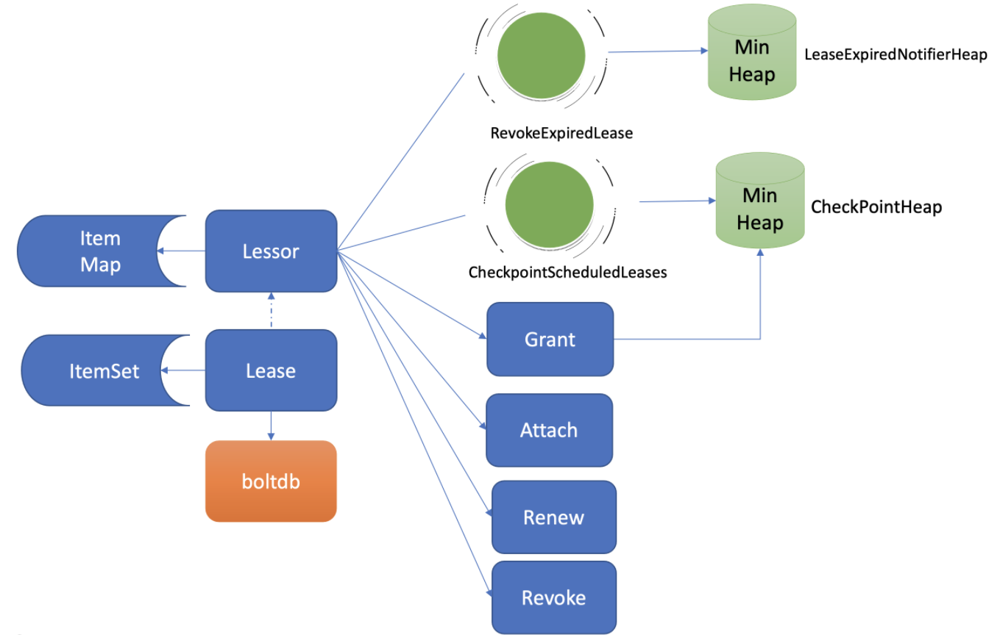

# 问题汇总

1. ETCD 集群中，每个节点都有 WAL 和状态机功能吗？ WAL 不是 leader 节点才起作用的？

作者回复: 是的，每个节点都有WAL, leader会向follower节点同步raft日志条目，日志条目中保存请求的命令，follower收到后会保存到wal中，此日志条目被提交后，各个节点应用它到状态机boltdb等中.


# 1、集群协调服务的标准

> 1. 可用性角度,高可用
>
>    协调服务作为集群的控制面存储，它保存了各个服务的部署、运行信息。若它故障，可能会导致集群无法变更、服务副本数无法协调。业务服务若此时出现故障，无法创建新的副本，可能会影响用户数据面。
>
> 2. 数据一致性角度:提供读取“最新”数据的机制
>
> 3. 容量角度:低容量、仅存储、仅存储关键元数据配置
>
> 4. 功能:增删改查,监听数据变化的机制
>
> 5. 运维复杂性,可维护性


# 2、etc d 存储模式

简单内存树


# 3、V2 和V3的对比

## A、V2版本

1. <font color=red size=5x>V2 不支持范围查询(模糊匹配)和分页查询</font>
2. <font color=green size=5x>V2 不支持Watch的可靠性,V2是内存型,不支持key的历史版本问题</font>
3. <font color=red size=5x>V2是基于http1.x的长连接,不支持多路复用,没有http的压缩功能</font>
4. <font color=green size=5x>V2 不支持统一过期时间的key的设置,要为每个key设置过期时间</font>
5. <font color=red size=5x>V2 在内存中维护一棵树存储所有key和value,同步磁盘回消耗大量CPU资源和磁盘I/O资源</font>
6. <font color=green size=5x>V2 不支持范围查询(模糊匹配)和分页查询</font>


## B、V3版本

1. <font color=green size=5x>V3 通过引入B- tree、boltDb实现MVCC数据库,降低内存使用率</font>
2. <font color=red size=5x>V3 实现事务,支持多个key的原子更新</font>
3. <font color=green size=5x>V3 使用了gRPC API,降低json格式的开销</font>
4. <font color=red size=5x>V3 支持http2的多路复用,减少watch下的连接数</font>
5. <font color=green size=5x>V3 lease优化TTl的问题,每个lease具有一个TTL,相同的TTL的key随着lease的过期而过期</font>
6. <font color=red size=5x>V3支持范围查询(模糊匹配)和分页查询</font>


# 4、V3基础架构

## A、架构图


> 1、client层 
>
> client 层包括 client v2 和 v3 两个大版本 API 客户端库，提供了简洁易用的 API，同时支持负载均衡、节点间故障自动转移，可极大降低业务使用 etcd 复杂度，提升开发效率、服务可用性。

> 2、API网络层
>
> client和server的通信协议
>
> V2和V3的api，==V3通过 grpc的 grpc-getWay组件支持HTTP1.x协议==
>
> ==server间通过Raft算法实现的数据复制和Leader的选举使用的HTTP2协议==

> 3、raft算法层
>
> Raft算法层实现了Leader选举、日志复制、RadeIndex等核心算法、保证etcd多个节点间的数据一致性、提升服务可用性等，是etcd的基石和亮点

> 4、功能逻辑层
>
> etcd核心特性实现层，KVServer模块、MVCC模块、AUth鉴权模块、Lease租约模块、Compactor压缩模块，==其中MVCC是由treeIndex模块和boltdb模块组成==

> 5、存储层
>
> 存储层 ：存储层含预写日志（WAL）模块、快照（Snapshot）模块、botdb模块，其中WAL是保证etcd crash后数据不丢失，boltdb保证数据的持久化


## B、KVServer

client 发送 Range RPC 请求到了 server 后，就开始进入我们架构图中的流程二，也就是 KVServer 模块了。

etcd 提供了丰富的 metrics、日志、请求行为检查等机制，可记录所有请求的执行耗时及错误码、来源 IP 等，也可控制请求是否允许通过，比如 etcd Learner 节点只允许指定接口和参数的访问

### 拦截器

<font color=red size=5x>要求执行一个操作前集群必须有 Leader，防止脑裂；</font>

<font color=r size=5x>**请求延时超过指定阈值的，打印包含来源 IP 的慢查询日志 (3.5 版本)**</font>

实现方法的非入侵式的、日志、请求行为等检查机制

etcd server 定义了如下的 Service KV 和 Range 方法，启动的时候它会将实现 KV 各方法的对象注册到 gRPC Server，并在其上注册对应的拦截器。下面的代码中的 Range 接口就是负责读取 etcd key-value 的的 RPC 接口。

```go
service KV {  
  // Range gets the keys in the range from the key-value store.  
  rpc Range(RangeRequest) returns (RangeResponse) {  
      option (google.api.http) = {  
        post: "/v3/kv/range"  
        body: "*"  
      };  
  }  
  ....
}  
```


## C、串行读

 <font color=green size=5x>**这种直接读取状态机的,无需通过Raft协议的与集群交互的方式,是串行读**</font>

 <font color=red size=5x>**串行读具有低延时、高吞吐量的特点,适合对数据一致性不高的场景**</font>


## D、线性读流程-默认

<font color=red size=5x>**etcd默认是线性读**</font>


### 线性读ReadIndex

读到距数据的原因是因为Follwer节点收到leader的同步写请求后,应用到自己的日志状态机是个异步过程

1. <font color=red size=5x>**请求向C节点发送查询请求,会发起ReadIndex的请求,会像leader获取集群的==最新的已经提交的日志索引(committed index)**</font>
2. <font color=r size=5x>**Leader收到ReadIndex请求后,==为防止脑裂,会像Follwer发送心跳确认,一半以上==节点确认Leader身份后才能将已提交的索引返回给C**</font>
3. <font color=green size=5x>**C节点会等待,直到状态机已应用索引(applied index)大于等于Leader的已提交时候,==然后通知读请求,可以去读取数据了==**</font>
4. <font color=red size=5x>**KVServer 模块收到线性读请求后，通过架构图中流程三向 Raft 模块发起 ReadIndex 请求，Raft 模块将 Leader 最新的已提交日志索引封装在流程四的 ReadState 结构体，通过 channel 层层返回给线性读模块，线性读模块等待本节点状态机追赶上 Leader 进度，追赶完成后，就通知 KVServer 模块，进行架构图中流程五，与状态机中的 MVCC 模块进行进行交互了。**</font>


### MVCC

1. <font color=red size=5x>**etcdV2是基于内存不支持事务控制**</font>
2. <font color=rd size=5x>**V3的核心是==内存树形索引(treeindex)和嵌入式的KV持久化道boltdb组成**</font>
3. <font color=blue size=5x>**每次修改操作，生成一个新的版本号 (revision)，以版本号为 key， value 为用户 key-value 等信息组成的结构体。**</font>
4. <font color=red size=5x>**boltdb 的 key 是全局递增的版本号 (revision)，value 是用户 key、value 等字段组合成的结构体，然后通过 treeIndex 模块来保存用户 key 和版本号的映射关系。**</font>


==treeIndex 与 boltdb 关系如下面的读事务流程图所示，从 treeIndex 中获取 key hello 的版本号，再以版本号作为 boltdb 的 key，从 boltdb 中获取其 value 信息。==


### treeIndex

<font color=red size=5x>B-tree 数据结构保存用户 key 与版本号之间的映射关系</font>

<font color=red size=5x>==treeIndex 模块只会保存用户的 key 和相关版本号信息，用户 key 的 value 数据存储在 boltdb 里面，相比 ZooKeeper 和 etcd v2 全内存存储，etcd v3 对内存要求更低。==</font>


从 treeIndex 模块中获取 hello 这个 key 对应的版本号信息。treeIndex 模块基于 B-tree 快速查找此 key，返回此 key 对应的索引项 keyIndex 即可。索引项中包含版本号等信息。


### buffer

在获取到版本号信息后，就可从 boltdb 模块中获取用户的 key-value 数据了。不过有一点你要注意，并不是所有请求都一定要从 boltdb 获取数据。etcd 出于数据一致性、性能等考虑，在访问 boltdb 前，首先会从一个内存读事务 buffer 中，==二分查找你要访问 key 是否在 buffer 里面==，若命中则直接返回。


### boltdb

<font color=re size=5x>**我们知道 MySQL 通过 table 实现不同数据逻辑隔离，那么在 boltdb 是如何隔离集群元数据与用户数据的呢？答案是 ==bucket。boltdb 里每个 bucket 类似对应 MySQL 一个表，`用户的 key 数据存放的 bucket 名字的是 key`，etcd MVCC 元数据存放的 bucket 是 meta。==**</font>


<font color=red size=5x>**因 boltdb 使用 B+ tree 来组织用户的 key-value 数据，获取 bucket key 对象后，通过 boltdb 的游标 Cursor 可快速在 B+ tree 找到 key hello 对应的 value 数据，返回给 client。**</font>


### 数据不一致场景

1、 <font color=red size=5x>**client 发起请求,读取状态机C,c盘出现网络波动,导致日志同步变慢**</font>

2、<font color=red size=5x>**因此读取到的数据可能是旧数据**</font>


## 读取流程

<font color=red size=5x>**一个读请求从 client 通过 Round-robin 负载均衡算法，选择一个 etcd server 节点，发出 gRPC 请求，经过 etcd server 的 KVServer 模块、线性读模块、MVCC 的 treeIndex 和 boltdb 模块紧密协作，完成了一个读请求。**</font>


早期 etcd 线性读使用的 Raft log read，也就是说把读请求像写请求一样走一遍 Raft 的协议，基于 Raft 的日志的有序性，实现线性读。但此方案读涉及磁盘 IO 开销，性能较差，后来实现了 ReadIndex 读机制来提升读性能


# 5、环境准备

```go
go get github.com/mattn/goreman
```

下载 etcd v3.4.9 二进制文件

```go
https://github.com/etcd-io/etcd/releases/v3.4.9
```

启动集群

goreman -f Procfile start命令就可以快速启动一个 3 节点的本地集群了。

```go
goreman -f Procfile start
```


clientv3 库基于 gRPC client API 封装了操作 etcd KVServer、Cluster、Auth、Lease、Watch 等模块的 API，同时还包含了负载均衡、健康探测和故障切换等特性。


如果你的 client 版本 <= 3.3，那么当你配置多个 endpoint 时，负载均衡算法仅会从中选择一个 IP 并创建一个连接（Pinned endpoint），这样可以节省服务器总连接数。但在这我要给你一个小提醒，在 heavy usage 场景，这可能会造成 server 负载不均衡。在 client 3.4 之前的版本中，负载均衡算法有一个严重的 Bug：如果第一个节点异常了，可能会导致你的 client 访问 etcd server 异常，特别是在 Kubernetes 场景中会导致 APIServer 不可用。不过，该 Bug 已在 Kubernetes 1.16 版本后被修复。


# 6、etcd写请求


```go
etcdctl put hello world --endpoints http://127.0.0.1:2379
OK
```

1. <font color=red size=5x>client通过负载均衡选择一个etcd节点,发起gRPC调用</font>

2. <font color=red size=5x>然后etcd节点收到请求后经过==gRPC拦截器、Qupta模块后,进入KVServer模块==</font>

3. <font color=re size=5x>KVServer像Raft提交一个提案</font>

4. <font color=red size=5x>随后提案经过RaftHTTP网络模块转发,经过集群多数节点持久化后,状态变为已提交模块</font>

5. <font color=red size=5x>传递给apply模块,apply模块通过MVCC模块之执行天内容,更新状态机</font>

   <font color=red size=5x>client通过负载均衡选择一个etcd节点,发起gRPC调用</font>


## A、Quota db配额模块

```go
etcdserver: mvcc: database space exceeded
```

<font color=red size=5x>**db默认配额是2GB**</font>

<font color=re size=5x>**每1小时进行一次压缩，并且保留8个小时的数据量，同时最大空间是默认的2GiB。**</font>

<font color=red size=5x>**db默认配额是2GB**</font>

<font color=red size=5x>**db默认配额是2GB**</font>


<font color=red size=5x>**==工作原理==**</font>

> 1. 当 etcd server 收到 put/txn 等写请求的时候，会首先检查下当前 etcd db 大小加上你请求的 key-value 大小之和是否超过了配额（quota-backend-bytes）。
> 2. ==如果超过了配额，它会产生一个告警（Alarm）请求，告警类型是 NO SPACE，并通过 Raft 日志同步给其它节点，告知 db 无空间了，并将告警持久化存储到 db 中。==
> 3. 最终，无论是 API 层 gRPC 模块还是负责将 Raft 侧已提交的日志条目应用到状态机的 Apply 模块，都拒绝写入，集群只读。


## KVServer模块

通过流程二的配额检查后，请求就从 API 层转发到了流程三的 KVServer 模块的 put 方法，我们知道 etcd 是基于 Raft 算法实现节点间数据复制的，==因此它需要将 put 写请求内容打包成一个提案消息，提交给 Raft 模块。==不过 KVServer 模块在提交提案前，还有如下的一系列检查和限速。


<font color=red size=5x>==**Preflight Check**==</font>

1. <font color=red size=5x>**其次它会检查你写入的包大小是否超过默认的 1.5MB， 如果超过了会返回"etcdserver: request is too large"错误给给 client。**</font>

2. <font color=red size=5x>**<u>如果 Raft 模块已提交的日志索引（committed index）比已应用到状态机的日志索引（applied index）超过了 5000</u>**，那么它就返回一个"etcdserver: too many requests"错误给 client。</font>
3. 

为了保证集群稳定性，避免雪崩，任何提交到 Raft 模块的请求，都会做一些简单的限速判断。如下面的流程图所示，首先，**<u>如果 Raft 模块已提交的日志索引（committed index）比已应用到状态机的日志索引（applied index）超过了 5000</u>**，那么它就返回一个"etcdserver: too many requests"错误给 client。


然后它会尝试去获取请求中的鉴权信息，若使用了密码鉴权、请求中携带了 token，如果 token 无效，则返回"auth: invalid auth token"错误给 client。

其次它会检查你写入的包大小是否超过默认的 1.5MB， 如果超过了会返回"etcdserver: request is too large"错误给给 client。


<font color=red size=5x>**Propose**</font>

最后通过一系列检查之后，会生成一个唯一的 ID，将此请求关联到一个对应的消息通知 channel，然后向 Raft 模块发起（Propose）一个提案（Proposal），提案内容为“大家好，请使用 put 方法执行一个 key 为 hello，value 为 world 的命令”，也就是整体架构图里的流程四。

向 Raft 模块发起提案后，KVServer 模块会等待此 put 请求，等待写入结果通过消息通知 channel 返回或者超时。==etcd 默认超时时间是 7 秒（5 秒磁盘 IO 延时 +2*1 秒竞选超时时间），如果一个请求超时未返回结果，则可能会出现你熟悉的 etcdserver: request timed out 错误。==


## WAL模块

1. <font color=red size=5x>**Raft 模块收到提案后，如果当前节点是 Follower，它会转发给 Leader，只有 Leader 才能处理写请求。**</font>
2. <font color=green size=5x>**etcdserver 从 Raft 模块获取到以上消息和日志条目后，作为 Leader，它会将 put 提案消息广播给集群各个节点，``同时需要把集群 Leader 任期号、投票信息、已提交索引、提案内容持久化到一个 WAL（Write Ahead Log）日志文件中``，用于保证集群的一致性、可恢复性。**</font>
3. <font color=re size=5x>**最后计算 WAL 记录的长度，顺序先写入 WAL 长度（Len Field），然后写入记录内容，调用 fsync 持久化到磁盘异步，完成将日志条目保存到持久化存储中。**</font>
4. <font color=red size=5x>**当一半以上节点持久化此日志条目后， Raft 模块就会通过 channel 告知 etcdserver 模块，put 提案已经被集群多数节点确认，提案状态为已提交，你可以执行此提案内容了。**</font>
5. <font color=red size=5x>**etcdserver 模块从 channel 取出提案内容，添加到先进先出（FIFO）调度队列，随后通过 Apply 模块按入队顺序，异步、依次执行提案内容。**</font>


1. Leader 收到提案后，通过 Raft 模块输出待转发给 Follower 节点的消息和待持久化的日志条目，日志条目则封装了我们上面所说的 put hello 提案内容。


## Apply模块


<font color=red size=5x>**如何保证etcd crash后,找回异常提案**</font>

> 核心就是我们上面介绍的 WAL 日志，因为提交给 Apply 模块执行的提案已获得多数节点确认、持久化，etcd 重启时，会从 WAL 中解析出 Raft 日志条目内容，追加到 Raft 日志的存储中，并重放已提交的日志提案给 Apply 模块执行。


<font color=red size=5x>**如何保证幂等性**</font>

==日志条目中的索引（index）字段和DB提交是原子性操作,保证幂等性==

> 答案就是我们上面介绍 Raft ==日志条目中的索引（index）字段。==日志条目索引是全局单调递增的，每个日志条目索引对应一个提案， 如果一个命令执行后，我们在 db 里面也记录下当前已经执行过的日志条目索引，是不是就可以解决幂等性问题呢？
>
> 是的。但是这还不够安全，如果执行命令的请求更新成功了，更新 index 的请求却失败了，是不是一样会导致异常？
>
> ==因此我们在实现上，还需要将两个操作作为原子性事务提交，才能实现幂等。==


> etcd 通过引入一个 consistent index 的字段，来存储系统当前已经执行过的日志条目索引，实现幂等性。
>
> Apply 模块在执行提案内容前，首先会判断当前提案是否已经执行过了，如果执行了则直接返回，若未执行同时无 db 配额满告警，则进入到 MVCC 模块，开始与持久化存储模块打交道。


## MVCC

Apply 模块判断此提案未执行后，就会调用 MVCC 模块来执行提案内容。MVCC 主要由两部分组成，一个是内存索引模块 treeIndex，保存 key 的历史版本号信息，另一个是 boltdb 模块，用来持久化存储 key-value 数据。那么 MVCC 模块执行 put hello 为 world 命令时，它是如何构建内存索引和保存哪些数据到 db 呢？

<font color=red size=5x>**内存索引模块treeIndex**</font>

<font color=red size=5x>**==treeIndex保存在内存中,重新会更新最大的版本号到内存==**</font>

版本号（revision）在 etcd 里面发挥着重大作用，它是 etcd 的逻辑时钟。etcd 启动的时候默认版本号是 1，随着你对 key 的增、删、改操作而全局单调递增。


> MVCC 写事务在执行 put hello 为 world 的请求时，会基于 currentRevision 自增生成新的 revision 如{2,0}，然后从 treeIndex 模块中查询 key 的创建版本号、修改次数信息。这些信息将填充到 boltdb 的 value 中，同时将用户的 hello key 和 revision 等信息存储到 B-tree


## boltdb

<font color=red size=5x>**B+tree实现**</font>

MVCC 写事务自增全局版本号后生成的 revision{2,0}，它就是 boltdb 的 key，通过它就可以往 boltdb 写数据了，进入了整体架构图中的流程九。


boltdb 上一篇我们提过它是一个基于 B+tree 实现的 key-value 嵌入式 db，它通过提供桶（bucket）机制实现类似 MySQL 表的逻辑隔离。


在 etcd 里面你通过 put/txn 等 KV API 操作的数据，全部保存在一个名为 key 的桶里面，这个 key 桶在启动 etcd 的时候会自动创建。


除了保存用户 KV 数据的 key 桶，etcd 本身及其它功能需要持久化存储的话，都会创建对应的桶。比如上面我们提到的 etcd 为了保证日志的幂等性，保存了一个名为 consistent index 的变量在 db 里面，它实际上就存储在元数据（meta）桶里面。


## etcd 的解决方案是合并再合并。

首先 boltdb key 是版本号，put/delete 操作时，都会基于当前版本号递增生成新的版本号，因此属于顺序写入，可以调整 boltdb 的 bucket.FillPercent 参数，使每个 page 填充更多数据，减少 page 的分裂次数并降低 db 空间。

<font color=red size=5x>**其次 etcd 通过合并多个写事务请求，通常情况下，是异步机制定时（默认每隔 `100ms`）将批量事务一次性提交（pending 事务过多才会触发同步提交）， 从而大大提高吞吐量.**</font>


## 因为事务未提交，读请求可能无法从 boltdb 获取到最新数据。

为了解决这个问题，etcd 引入了一个 bucket buffer 来保存暂未提交的事务数据。在更新 boltdb 的时候，etcd 也会同步数据到 bucket buffer。因此 etcd 处理读请求的时候会优先从 bucket buffer 里面读取，其次再从 boltdb 读，通过 bucket buffer 实现读写性能提升，同时保证数据一致性。


## 注意

<font color=red size=5x>**为什么当你把配额（quota-backend-bytes）调大后，集群依然拒绝写入呢?**</font>

原因就是我们前面提到的 NO SPACE 告警。Apply 模块在执行每个命令的时候，都会去检查当前是否存在 NO SPACE 告警，如果有则拒绝写入。所以还需要你额外发送一个取消告警（etcdctl alarm disarm）的命令，以消除所有告警。


<u>如果你使用的是 etcd 3.2.10 之前的旧版本，请注意备份可能会触发 boltdb 的一个 Bug，它会导致 db 大小不断上涨，最终达到配额限制</u>


# ==常用命令==

## 查看etcd的配额使用量

```
[root@k8s001 ~]# export ETCDCTL_API=3
[root@k8s001 ~]# etcdctl endpoint status --write-out table
+----------------+------------------+---------+---------+-----------+-----------+------------+
|    ENDPOINT    |        ID        | VERSION | DB SIZE | IS LEADER | RAFT TERM | RAFT INDEX |
+----------------+------------------+---------+---------+-----------+-----------+------------+
| 127.0.0.1:2379 | 8e9e05c52164694d |  3.3.10 |  7.8 MB |      true |         3 |    3085227 |
+----------------+------------------+---------+---------+-----------+-----------+------------+
```


## 开启磁盘碎片整理

1. 获取历史版本号

```
[root@k8s001 ~]# export ETCDCTL_API=3
[root@k8s001 ~]# etcdctl endpoint status --write-out="json" | egrep -o '"revision":[0-9]*' | egrep -o '[0-9].*'
8991138
```

2. 压缩旧版本

```
[root@k8s001 ~]# etcdctl compact 8991138
compacted revision 8991138
```

3. etcd进行碎片整理

```
[root@k8s001 ~]# etcdctl defrag  
Finished defragmenting etcd member[127.0.0.1:2379]
```

4.查看etcd数据库大小

```
[root@k8s001 ~]# etcdctl endpoint status --write-out table
+----------------+------------------+---------+---------+-----------+-----------+------------+
|    ENDPOINT    |        ID        | VERSION | DB SIZE | IS LEADER | RAFT TERM | RAFT INDEX |
+----------------+------------------+---------+---------+-----------+-----------+------------+
| 127.0.0.1:2379 | 8e9e05c52164694d |  3.3.10 |  1.3 MB |      true |         3 |    3089646 |
+----------------+------------------+---------+---------+-----------+-----------+------------+
```

## 修改etcd空间配额大小

1.修改systemd文件

```
[root@k8s001 ~]# cat /etc/systemd/system/etcd.service 
......
--quota-backend-bytes=10240000000 # 这里单位是字节
......
```

2.重启etcd服务

```
[root@k8s001 ~]# systemctl daemon-reload
[root@k8s001 ~]# systemctl restart etcd
```


## 清除NO SPACE警告

```go
$ etcdctl --endpoints=http://127.0.0.1:2379 alarm disarm
```

## 开启鉴权

鉴权用户

```
$ etcdctl user add root:root
User root created
$ etcdctl auth enable
Authentication Enabled
```

## 增加账号

下面我通过鉴权模块的 user 命令，给 etcd 增加一个 alice 账号。

```
$ etcdctl user add alice:alice --user root:root
User alice created
```

## 授权

```
$ etcdctl put hello world --user alice:alice
Error: etcdserver: permission denied
```


```go
$ #创建一个admin role 
etcdctl role add admin  --user root:root
Role admin created
# #分配一个可读写[hello，helly]范围数据的权限给admin role
$ etcdctl role grant-permission admin readwrite hello helly --user root:root
Role admin updated
# 将用户alice和admin role关联起来，赋予admin权限给user
$ etcdctl user grant-role alice admin --user root:root
Role admin is granted to user alice
```


## 创建租约并查看剩余时间

```go
# 创建一个TTL为600秒的lease，etcd server返回LeaseID
$ etcdctl lease grant 600
lease 326975935f48f814 granted with TTL(600s)


# 查看lease的TTL、剩余时间
$ etcdctl lease timetolive 326975935f48f814
lease 326975935f48f814 granted with TTL(600s)， remaining(590s)
```


## 数据关联lease

Key node value-healthy

```go
$ etcdctl put node healthy --lease 326975935f48f818
OK
$ etcdctl get node -w=json | python -m json.tool
{
    "kvs":[
        {
            "create_revision":24，
            "key":"bm9kZQ=="，
            "Lease":3632563850270275608，
            "mod_revision":24，
            "value":"aGVhbHRoeQ=="，
            "version":1
        }
    ]
}
```


## 开启checkPoint机制

```go
最后你要注意的是，此特性对性能有一定影响，目前仍然是试验特性。你可以通过 experimental-enable-lease-checkpoint 参数开启。
```


# ==Raft协议==


## 1、共识算法的三原则

> 1. Leader 选举，Leader 故障后集群能快速选出新 Leader；
> 2. 日志复制， ==集群只有 Leader 能写入日志==， Leader 负责复制日志到 Follower 节点，并强制 Follower 节点与自己保持相同；
> 3. 安全性，==一个任期内集群只能产生一个 Leader==、已提交的日志条目在发生 Leader 选举时，**一定会存在`更高任期`的新 Leader 日志中**、各个节点的状态机应用的任意位置的日志条目内容应一样等。


## 2、Leader选举

## 写入流程

1. <font color=red size=5x>**当etcd收到put hello的时候,KV模块会像Raft模块提交一个put提案**</font>

2. <font color=re size=5x>**只有集群的leader才能处理提案**</font>

3. <font color=red size=5x>**如果整个集群无leader,会请求超时**</font>


## 三角色

> 1. <font color=re size=5x>**Follower,跟随者,同步从leader收到的日志,etcd启动的时候默认为此状态**</font>
> 2. <font color=red size=5x>**Candidate,竞选者,可以发起leader的选举**</font>
> 3. <font color=re size=5x>**Leader,集群领导者,`唯一性`,拥有同步日志的特权,需要`定时广播心跳给Follwer节点,以维持领导者身份`**</font>


## 3、选举过程


> 1. <font color=red size=5x>**正常情况下,Leader节点会定时按照心跳间隔时间,定时的发送心跳小心(MsgHeartBeat消息)给Follwer节点,维持Leader身份,Follower收到后回定时回复(MsgHeartBeatResp消息)给Leader**</font>
> 2. <font color=green size=5x>**tear任期号在etcd中是逻辑时钟**</font>


<font color=re size=5x>**leader crash后的选举过程**</font>

> 1. <font color=red size=5x>**当Leader异常之后,Follower节点回收到Leader的心跳超时,==当超时时间大于竞选时间后==,回进入Candidate状态**</font>
> 2. <font color=red size=5x>**etcd默认的==心跳时间是(heartbeat-interval)`100ms`,默认精选超时时间是`1000ms`,==可根据实际情况进行设定**</font>
> 3. <font color=re size=5x>**进入Candidate的节点回立即发起选举流程,==自增任期号,头片给自己==**并向其他节点发送精选Leader的消息(MsgVote)</font>
> 4. <font color=red] size=5x>**第一种情况,B和C的数据一样,`B的任期大于C,并且C未投票给其他人`,就可以投票给B,这时候B获得多数节点的支持,称为Leader**</font>
> 5. <font color=red size=5x>**第二种,恰巧C的超时时间也超过了精选的时间,发起精选,并投票给自己,那么将拒绝B的投票请求,这时候谁都获取不了多数的支持,等待超时,重新选举,为了解决这种情况,`Raft引入随机数让每个节点发起请求的时间点不一样,`优雅的解决竞争活锁的问题**</font>
> 6. <font color=blue size=5x>**旧Leader发现新的Leader的任期号大于自己,回自动转变为Follower角色**</font>


==A 节点 crash 后，再次启动成为 Follower，假设因为网络问题无法连通 B、C 节点，这时候根据状态图，我们知道它将不停自增任期号，发起选举。等 A 节点网络异常恢复后，那么现有 Leader 收到了新的任期号，就会触发新一轮 Leader 选举，影响服务的可用性。==

###  **服务Leader重新加入新的集群怎么分辨真假Leader**

> 1. <font color=red size=5x>**新加入的节点的数据会远落后于B、C节点,无法获取Leader地位**</font>


###  如何避免无效选举

> 1. <font color=red size=5x>**Follower在进入Candidate之前会进入PreVote参数(默认false)进入PreCandidate状态,==不自增任期号==发起预投票,获得多数节点认可,确定成为Leader才能进入Candidate状态,发起选举流程**</font>

在 etcd 3.4 中，etcd 引入了一个 PreVote 参数（默认 false），可以用来启用 PreCandidate 状态解决此问题，如下图所示。Follower 在转换成 Candidate 状态前，先进入 PreCandidate 状态，不自增任期号， 发起预投票。若获得集群多数节点认可，确定有概率成为 Leader 才能进入 Candidate 状态，发起选举流程。


## 4、日志复制


> 1. 首先 Leader 收到 client 的请求后，etcdserver 的 KV 模块会向 Raft 模块提交一个 put hello 为 world 提案消息（流程图中的序号 2 流程）， 它的消息类型是 MsgProp。
> 2. Leader 的 Raft 模块获取到 MsgProp 提案消息后，为此提案生成一个日志条目，追加到==未持久化、不稳定的 Raft 日志中==，随后会遍历集群 Follower 列表和进度信息，为每个 Follower 生成追加（MsgApp）类型的 RPC 消息，此消息中包含待复制给 Follower 的日志条目。


### Leader从哪个索引位置发送日志

> <font color=red size=5x>**Leader会维护Follower节点的进度信息,一个是NextIndex(表示发送给Folower的条目索引),一个是MatchIndex(表示Folower最大复制日志索引条目)**</font>


### 日志什么时候才会追加到稳定的Raft日志中?Raft负责持久化吗?

etcd Raft 模块设计实现上抽象了网络、存储、日志等模块，它本身并不会进行网络、存储相关的操作，上层应用需结合自己业务场景选择内置的模块或自定义实现网络、存储、日志等模块。

> 1. <font color=red size=5x>**不会进行持久化操作,WAL进行持久化**</font>
> 2.  <font color=red size=5x>**先进行WAL操作,然后同步==最后同步到持久化日志中==**</font>
>
> 3. <font color=re size=5x>**Leader 可通过在发送心跳消息（MsgHeartbeat）给 Follower 节点时，告知它已经提交的日志索引位置。**</font>
> 4. <font color=red、 size=5x>**日志提交的前提是获取一半以上的节点的确认**</font>

上层应用通过 Raft 模块的输出接口（如 Ready 结构），获取到待持久化的日志条目和待发送给 Peer 节点的消息后（如上面的 MsgApp 日志消息），需持久化日志条目到自定义的 WAL 模块，通过自定义的网络模块将消息发送给 Peer 节点。


### 安全性

>  如果在上面的日志图 2 中，Leader B 在应用日志指令 put hello 为 world 到状态机，并返回给 client 成功后，突然 crash 了，那么 Follower A 和 C 是否都有资格选举成为 Leader 呢？
>
> 从日志图 2 中我们可以看到，如果 A 成为了 Leader 那么就会导致数据丢失，因为它并未含有刚刚 client 已经写入成功的 put hello 为 world 指令。


**Raft 算法如何确保面对这类问题时不丢数据和各节点数据一致性呢？**

> 1. <font color=red、 size=5x>**前来要票的日志是否是最新的**</font>
> 2. <font color=red size=5x>**任期号是否比自己大**</font>
> 3. <font color=re size=5x>**一个任期内只有一个Leader**</font>
> 4. <font color=red、 size=5x>**日志提交的前提是获取一半以上的节点的确认**</font>

当节点收到选举投票的时候，需检查候选者的最后一条日志中的任期号，若小于自己则拒绝投票。如果任期号相同，日志却比自己短，也拒绝为其投票。

比如在日志图 2 中，Folllower A 和 C 任期号相同，但是 Follower C 的数据比 Follower A 要长，那么在选举的时候，Follower C 将拒绝投票给 A， 因为它的数据不是最新的。

同时，对于一个给定的任期号，最多只会有一个 leader 被选举出来，leader 的诞生需获得集群一半以上的节点支持。每个节点在同一个任期内只能为一个节点投票，节点需要将投票信息持久化，防止异常重启后再投票给其他节点。通过以上规则就可防止日志图 2 中的 Follower A 节点成为 Leader。

### 日志复制规则

> 1. 在日志图 2 中，Leader B 返回给 client 成功后若突然 crash 了，此时可能还并未将 6 号日志条目已提交的消息通知到 Follower A 和 C，那么如何确保 6 号日志条目不被新 Leader 删除呢？ 同时在 etcd 集群运行过程中，Leader 节点若频繁发生 crash 后，可能会导致 Follower 节点与 Leader 节点日志条目冲突，如何保证各个节点的同 Raft 日志位置含有同样的日志条目？
> 2. 以上各类异常场景的安全性是通过 Raft 算法中的 Leader 完全特性和只附加原则、日志匹配等安全机制来保证的。
> 3. Leader 完全特性是指如果某个日志条目在某个任期号中已经被提交，那么这个条目必然出现在更大任期号的所有 Leader 中。


<font color=red size=6x>**`Leader 只能追加日志条目，不能删除已持久化的日志条目（只附加原则）`，因此 Follower C 成为新 Leader 后，会将前任的 6 号日志条目复制到 A 节点。**</font>


> 为了保证各个节点日志一致性，Raft 算法在追加日志的时候，引入了一致性检查。Leader 在发送追加日志 RPC 消息时，会把新的日志条目紧接着之前的条目的索引位置和任期号包含在里面。==Follower 节点会检查相同索引位置的任期号是否与 Leader 一致，一致才能追加，这就是日志匹配特性。==它本质上是一种归纳法，一开始日志空满足匹配特性，随后每增加一个日志条目时，都要求上一个日志条目信息与 Leader 一致，那么最终整个日志集肯定是一致的。


# 7、etcd的鉴权

etcd 实现了 RBAC 机制，支持为每个用户分配一个角色，为每个角色授予最小化的权限。

## 开启鉴权

鉴权用户

```
$ etcdctl user add root:root
User root created
$ etcdctl auth enable
Authentication Enabled
```

## 增加账号

下面我通过鉴权模块的 user 命令，给 etcd 增加一个 alice 账号。

```
$ etcdctl user add alice:alice --user root:root
User alice created
```

## 授权

```
$ etcdctl put hello world --user alice:alice
Error: etcdserver: permission denied
```


```go
$ #创建一个admin role 
etcdctl role add admin  --user root:root
Role admin created
# #分配一个可读写[hello，helly]范围数据的权限给admin role
$ etcdctl role grant-permission admin readwrite hello helly --user root:root
Role admin updated
# 将用户alice和admin role关联起来，赋予admin权限给user
$ etcdctl user grant-role alice admin --user root:root
Role admin is granted to user alice
```


## 密码认证

### SimpleToken默认


###  JWT

## 证书认证

在 etcd 中，如果你使用了 HTTPS 协议并启用了 client 证书认证 (--client-cert-auth)，它会取 CN 字段作为用户名，在我们的案例中，alice 就是 client 发送请求的用户名。

## 查看client证书

```
openssl x509 -noout -text -in client.pem
```


# 8、租约--检测客户端存活

## 总结

>  Lease 的核心是 TTL，当 Lease 的 TTL 过期时，它会自动删除其关联的 key-value 数据。
>
> 
>
> 首先是 Lease 创建及续期。当你创建 Lease 时，etcd 会保存 Lease 信息到 boltdb 的 Lease bucket 中。为了防止 Lease 被淘汰，你需要定期发送 LeaseKeepAlive 请求给 etcd server 续期 Lease，本质是更新 Lease 的到期时间。
>
> 
>
> 续期的核心挑战是性能，etcd 经历了从 TTL 属性在 key 上，到独立抽象出 Lease，支持多 key 复用相同 TTL，同时协议从 HTTP/1.x 优化成 gRPC 协议，支持多路连接复用，显著降低了 server 连接数等资源开销。
>
> 
>
> 其次是 Lease 的淘汰机制，etcd 的 Lease 淘汰算法经历了从时间复杂度 O(N) 到 O(Log N) 的演进，核心是轮询最小堆的 Lease 是否过期，若过期生成 revoke 请求，它会清理 Lease 和其关联的数据。
>
>  Lease 的 checkpoint 机制，它是为了解决 Leader 异常情况下 TTL 自动被续期，可能导致 Lease 永不淘汰的问题而诞生。

## 1、Leader探活类型

> 1. <font color=red size=5x>**被动检测型,通过探测节点定时拨测Leader节点,如Redis Sentinel**</font>
> 2. <font color=re size=5x>**主动上报,Leader定期像协调节点上报状态,协调节点监控Leader状态**</font>


Lease 顾名思义，client 和 etcd server 之间存在一个约定，内容是 etcd server 保证在约定的有效期内（TTL），不会删除你关联到此 Lease 上的 key-value。

若你未在有效期内续租，那么 etcd server 就会删除 Lease 和其关联的 key-value。





>  etcd 在启动的时候，创建 Lessor 模块的时候，它会启动两个常驻 goroutine，如上图所示，一个是 RevokeExpiredLease 任务，定时检查是否有过期 Lease，发起撤销过期的 Lease 操作。一个是 CheckpointScheduledLease，定时触发更新 Lease 的剩余到期时间的操作。

Lessor 模块提供了 Grant、Revoke、LeaseTimeToLive、LeaseKeepAlive API 给 client 使用，各接口作用如下:

> 1. Grant 表示创建一个 TTL 为你指定秒数的 Lease，Lessor 会将 Lease 信息持久化存储在 boltdb 中
> 2. Revoke 表示撤销 Lease 并删除其关联的数据
> 3. LeaseTimeToLive 表示获取一个 Lease 的有效期、剩余时间
> 4. LeaseKeepAlive 表示为 Lease 续期


## 2、Key 关联Lease

创建一个 Lease，有效期为 600 秒。然后通过 timetolive 命令，查看 Lease 的有效期、剩余时间。

```go
# 创建一个TTL为600秒的lease，etcd server返回LeaseID
$ etcdctl lease grant 600
lease 326975935f48f814 granted with TTL(600s)


# 查看lease的TTL、剩余时间
$ etcdctl lease timetolive 326975935f48f814
lease 326975935f48f814 granted with TTL(600s)， remaining(590s)
```

当 Lease server 收到 client 的创建一个有效期 600 秒的 Lease 请求后，会通过 Raft 模块完成日志同步，随后 Apply 模块通过 Lessor 模块的 Grant 接口执行日志条目内容。


首先 Lessor 的 Grant 接口会把 Lease 保存到**内存的 ItemMap 数据结构中**，然后它需要持久化 Lease，将 Lease 数据保存到 boltdb 的 Lease bucket 中，返回一个唯一的 LeaseID 给 client。


### 数据健康指标数据关联lease

KV 模块的 API 接口提供了一个"--lease"参数，你可以通过如下命令，将 key node 关联到对应的 LeaseID 上。然后你查询的时候增加 -w 参数输出格式为 json，就可查看到 key 关联的 LeaseID。

```go
$ etcdctl put node healthy --lease 326975935f48f818
OK
$ etcdctl get node -w=json | python -m json.tool
{
    "kvs":[
        {
            "create_revision":24，
            "key":"bm9kZQ=="，
            "Lease":3632563850270275608，
            "mod_revision":24，
            "value":"aGVhbHRoeQ=="，
            "version":1
        }
    ]
}
```


以上流程原理如下图所示，它描述了用户的 key 是如何与指定 Lease 关联的。当你通过 put 等命令新增一个指定了"--lease"的 key 时，MVCC 模块它会通过 Lessor 模块的 Attach 方法，将 key 关联到 Lease 的 key 内存集合 ItemSet 中。


## 3、保存在内存的数据对应关系怎么保证crash不丢失

<h4>tcd 的 MVCC 模块在持久化存储 key-value 的时候，保存到 boltdb 的 value 是个结构体（mvccpb.KeyValue）， 它不仅包含你的 key-value 数据，还包含了关联的 LeaseID 等信息。因此当 etcd 重启时，可根据此信息，重建关联各个 Lease 的 key 集合列表。</h4>


## 4、优化lease续期

完成了 Lease 创建和数据关联操作。在正常情况下，你的节点存活时，需要定期发送 KeepAlive 请求给 etcd 续期健康状态的 Lease，否则你的 Lease 和关联的数据就会被删除。


<font color=red size=5x>**Lease 续期其实很简单，核心是将 Lease 的过期时间更新为当前系统时间加其 TTL**</font>


然而影响续期性能因素又是源自多方面的。首先是 TTL，TTL 过长会导致节点异常后，无法及时从 etcd 中删除，影响服务可用性，而过短，则要求 client 频繁发送续期请求。其次是 Lease 数，如果 Lease 成千上万个，那么 etcd 可能无法支撑如此大规模的 Lease 数，导致高负载。


### V2版本

每个key关联一个TTL时间

### V3

提出lease特性,TTL属性转移到Lease上<font color=red size=5x>**同时协议从 HTTP/1.x 优化成 gRPC 协议**</font>


一方面不同 key 若 TTL 相同，可复用同一个 Lease， 显著减少了 Lease 数。另一方面，通过 gRPC HTTP/2 实现了多路复用，流式传输，同一连接可支持为多个 Lease 续期，大大减少了连接数。


## 5、如何高效淘汰过期Lease

<font color=red size=5x>**淘汰过期 Lease 的工作由 Lessor 模块的一个==异步 goroutine 负责==。如下面架构图虚线框所示，它会定时从==最小堆中取出已过期的 Lease==，执行删除 Lease 和其关联的 key 列表数据的 `RevokeExpiredLease 任务。`**</font>


> 目前 etcd 是基于最小堆来管理 Lease，实现快速淘汰过期的 Lease。

> etcd 早期的时候，淘汰 Lease 非常暴力。etcd 会直接遍历所有 Lease，逐个检查 Lease 是否过期，过期则从 Lease 关联的 key 集合中，取出 key 列表，删除它们，时间复杂度是 O(N)。


> 刚刚说的就是 etcd Lease 高效淘汰方案最小堆的实现方法。**每次新增 Lease、续期的时候，它会插入、更新一个对象到最小堆中，对象含有 LeaseID 和其到期时间 unixnano，对象之间按到期时间升序排序。**


etcd Lessor 主循环<font color=red size=5x>**每隔 500ms 执行一次撤销 Lease 检查（RevokeExpiredLease）**</font>，每次轮询堆顶的元素，若已过期则加入到待淘汰列表，直到堆顶的 Lease 过期时间大于当前，则结束本轮轮询。


<font color=red size=5x>**它的时间复杂度是 O(Log N)**</font>


### 删除Follower的数据

获取到待过期的 LeaseID 后，Leader 是如何通知其他 Follower 节点淘汰它们呢？

> Lessor 模块会将已确认过期的 LeaseID，保存在一个名为 expiredC 的 channel 中，**而 etcd server 的主循环会定期从 channel 中获取 LeaseID，发起 revoke 请求，通过 Raft Log 传递给 Follower 节点**。
>
> 各个节点收到 revoke Lease 请求后，获取关联到此 Lease 上的 key 列表，从 boltdb 中删除 key，从 Lessor 的 Lease map 内存中删除此 Lease 对象，最后还需要从 boltdb 的 Lease bucket 中删除这个 Lease。


## ChekPoint机制

1. <font color=red size=5x>**checkPoint是为了防止leader重选,导致lease的TTl一直不过期的问题**</font>
2. <font color=re size=5x>**启动的时候异步跑脚本通过RaftLog同步给Follower节点**</font>
3. <font color=red size=5x>**当进行KeepAlive的时候出发同步**</font>


> 那么当 Leader 因重启、crash、磁盘 IO 等异常不可用时，Follower 节点就会发起 Leader 选举，新 Leader 要完成以上职责，必须重建 Lease 过期最小堆等管理数据结构，那么以上重建可能会触发什么问题呢？


> 当你的集群发生 Leader 切换后，新的 Leader 基于 Lease map 信息，按 Lease 过期时间构建一个最小堆时，etcd 早期版本为了优化性能，并未持久化存储 Lease 剩余 TTL 信息，因此重建的时候就会自动给所有 Lease 自动续期了。


> 然而若较频繁出现 Leader 切换，切换时间小于 Lease 的 TTL，这会导致 Lease 永远无法删除，大量 key 堆积，db 大小超过配额等异常。


一方面，etcd 启动的时候，Leader 节点后台会运行此异步任务，定期批量地将 Lease 剩余的 TTL 基于 Raft Log 同步给 Follower 节点，Follower 节点收到 CheckPoint 请求后，更新内存数据结构 LeaseMap 的剩余 TTL 信息。


另一方面，当 Leader 节点收到 KeepAlive 请求的时候，它也会通过 checkpoint 机制把此 Lease 的剩余 TTL 重置，并同步给 Follower 节点，尽量确保续期后集群各个节点的 Lease 剩余 TTL 一致性。


最后你要注意的是，此特性对性能有一定影响，目前仍然是试验特性。你可以通过 experimental-enable-lease-checkpoint 参数开启。


## 续约操作是谁完成

> 从原理上我们知道lease是leader在内存中维护过期最小堆的，因此续期操作client是必须要直接发送给leader的，如果follower节点收到了keepalive请求，会转发给leader节点。
>
> 
>
> 续期操作不经过raft协议处理同步，而leaseGrant/Revoke请求会经过raft协议同步给各个节点，因此任意节点都可以处理它。


